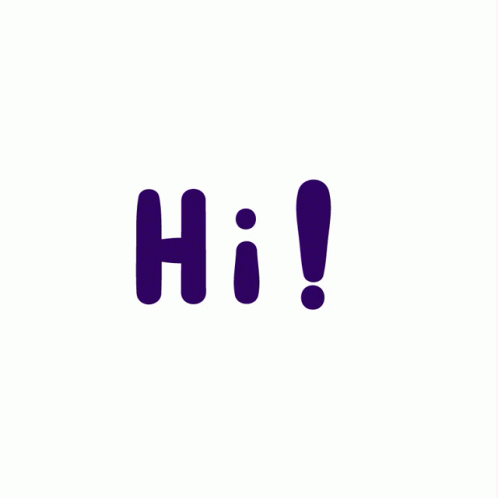

  
  <h1> I’m Adam Kaminski </h1>
  
 A lover of code, its possibilities <i>and a bit of coffee</i>.  
    A learner, team-player, team-leader and an optimistic go-getter!  
    Take a look around, get comfy, coffee?
  

    

  <h2> What am I doing right now? </h2>  
    - Exploring multiple languages (R, Haskell and the classics: Java, C#)  
    - Currently working on Machine Learning Algorithms  
    - In my 3rd year of a Bachelor of Computing degree at <a href="https://www.belgiumcampus.ac.za/bachelor-of-computing/" target="__blank">Belgium Campus</a> 
  

<!---
AdamKamZA/AdamKamZA is a ✨ special ✨ repository because its `README.md` (this file) appears on your GitHub profile.
You can click the Preview link to take a look at your changes.
--->
